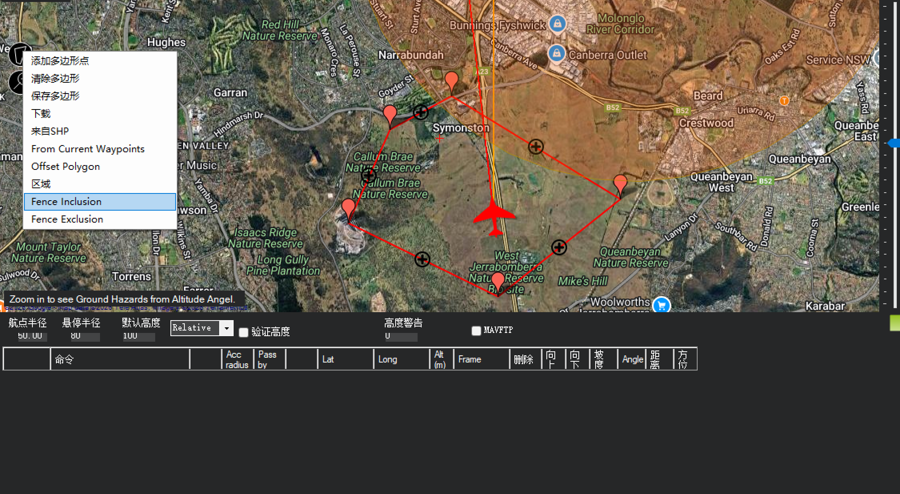

# Mission Planner 功能手册

## 第1章 环境准备与启动

### 1.1 启动 SITL（WSL）

**前置条件**：已在 WSL 中完成 ArduPilot 环境配置与编译。

**步骤**：
1. 在项目目录打开终端，进入 WSL：
   - `wsl -d Ubuntu-22.04`
2. 进入 ArduPilot 目录：
   - `cd ~/ardupilot`
3. 启动 SITL：
   - `sim_vehicle.py -v ArduPlane --console --map`
4. 成功标志：
   - 会弹出三个窗口：`console` / `map` / `ArduPlane`

**截图**：

### 1.2 Mission Planner 连接 SITL

**连接方式**：UDP  
**默认端口**：14550  

**步骤**：
1. 启动 Mission Planner
2. 等待自动连接（SITL 启动后会自动广播）

**连接成功标志**：
- 右上角显示：`UDP 115200`
- 右上角显示：`UDP14550-1-FIXED WING`

**截图**：

---

## 第2章 Flight Data 界面详解
（待补充）

## 第3章 航线规划指南

### 3.1 前置条件

- SITL 已启动（`sim_vehicle.py -v ArduPlane --console --map`）
- Mission Planner 已连接（右上角显示 `UDP 115200` 与 `UDP14550-1-FIXED WING`）

### 3.2 进入 Flight Plan 界面

顶部菜单点击 `FLIGHT PLAN` 进入航线规划界面。

界面主要区域：
- 地图区：中央地图，点击可添加航点
- 航点列表：下方表格区域，显示航点序号、经纬度、高度等
- 右侧工具区：常用按钮（`加载航点文件` / `保存航点文件` / `读取航点` / `写入航点` / `Write Fast`）
- 命令选择：下方表格中的 `命令` 列，用于选择航点类型

### 3.3 航点基本操作

**添加航点**  
- 在地图上左键点击：自动添加一个航点（默认 `WAYPOINT`）
- 航点会按顺序编号（0, 1, 2...）
- 航点 0 通常为 HOME 点

**移动航点**  
- 在地图上拖拽航点标记即可移动位置

**删除航点**  
- 在航点列表中选中航点行后删除

**修改参数**  
- 在航点列表中直接编辑高度、经纬度等参数

### 3.4 常用航点命令

- `WAYPOINT`：普通航点  
- `TAKEOFF`：起飞（固定翼需设定起飞高度）  
- `LOITER_TURNS`：盘旋指定圈数  
- `LOITER_TIME`：盘旋指定时间  
- `LOITER_UNLIM`：无限盘旋  
- `RETURN_TO_LAUNCH`（RTL）：返航  
- `LAND`：降落  

### 3.5 练习：创建一条简单航线

1. 清除现有航点：点击 `清除航点`
2. 确认 HOME 点：  
   - 连接后地图已有 HOME 点（示例高度约 587）  
   - 起飞位置就是 HOME 点，不需要另选位置  
3. 设置起飞点（TAKEOFF）：  
   - 选中第一个任务点（WP1），把命令改为 `TAKEOFF`  
   - 起飞位置使用 HOME 点（与飞机当前位置一致）  
   - 高度设为 50（可按需要调整）  
4. 添加 3 个航点：  
   - 继续点击地图添加 3 点  
   - 高度设为 80  
5. 添加盘旋点：  
   - 命令选择 `LOITER_TURNS`  
   - 圈数设为 2  
   - 高度设为 80  
6. 添加返航点：  
   - 命令选择 `RETURN_TO_LAUNCH`（RTL）  
   - 返航点坐标不会被用作目标点，实际会回到 HOME  

### 3.6 保存与上传航线

- `写入航点`：把当前航线写入飞控（SITL）
- `读取航点`：从飞控读取航线（会提示清空本地当前航点列表，确认后才读取）
- `保存航点文件`：保存为本地航线文件
- `加载航点文件`：从本地文件加载航线

建议将航线文件保存至：`docs/06-实践记录/SITL/`

### 3.7 航点表格字段说明

- `Acc radius`：到达航点的接受半径（进入该半径即认为到达）
- `Pass by dist`：掠过距离（通过而不精确到点的偏移距离）
- `Lat / Long`：航点经纬度
- `Alt (m)`：航点高度（米）
- `Frame`：高度参考系  
  - `Relative`：相对 HOME  
  - `Absolute`：相对海平面  
  - `Terrain`：相对地形
- `坡度`：相邻航点高度差与水平距离计算得到的航段坡度（不是俯仰角）
- `Angle`：相邻航段的转向角（航线夹角）
- `距离`：相邻航点间水平距离
- `方位角`：从当前航点指向下一个航点的地面航向角（不是偏航角）

### 3.8 常见命令说明（节选）

以下是任务列表中常见命令的简要说明：
- `RETURN_TO_LAUNCH`：返航回 HOME  
- `LOITER_TURNS`：按圈数盘旋  
- `LOITER_TIME`：按时间盘旋  
- `LOITER_UNLIM`：无限盘旋  
- `TAKEOFF`：起飞  
- `LAND`：降落  
- `DO_CHANGE_SPEED`：改变速度  
- `DO_SET_HOME`：设置 HOME  
- `DO_JUMP`：跳转到指定任务序号  

### 3.10 命令清单（参考）

- `WAYPOINT`：普通航点  
- `LOITER_UNLIM`：无限盘旋  
- `LOITER_TURNS`：按圈数盘旋  
- `LOITER_TIME`：按时间盘旋  
- `LOITER_TO_ALT`：盘旋并爬升/下降到指定高度  
- `RETURN_TO_LAUNCH`：返航（RTL）  
- `LAND`：降落  
- `TAKEOFF`：起飞  
- `DELAY` / `CONDITION_DELAY`：等待一段时间  
- `CONDITION_DISTANCE`：满足距离条件后继续  
- `CONDITION_YAW`：满足航向/偏航条件后继续  
- `DO_GRIPPER`：夹爪控制  
- `DO_LAND_START`：开始降落流程  
- `DO_SET_ROI`：设置兴趣点  
- `DO_SET_ROI_LOCATION`：设置兴趣点坐标  
- `DO_SET_ROI_NONE`：清除兴趣点  
- `DO_INVERTED_FLIGHT`：倒飞（固定翼）  
- `DO_SET_CAM_TRIGG_DIST`：按距离触发相机  
- `DO_JUMP`：跳转到指定任务序号  
- `JUMP_TAG` / `DO_JUMP_TAG`：带标签的跳转控制  
- `DO_CHANGE_SPEED`：改变速度  
- `DO_SET_HOME`：设置 HOME 点  
- `DO_SET_RELAY` / `DO_REPEAT_RELAY`：继电器控制/重复  
- `DO_SET_SERVO` / `DO_REPEAT_SERVO`：舵机控制/重复  
- `DO_DIGICAM_CONFIGURE`：相机参数配置  
- `DO_DIGICAM_CONTROL`：相机控制  
- `DO_MOUNT_CONTROL`：云台控制  
- `DO_GIMBAL_MANAGER_PITCHYAW`：云台俯仰/偏航控制  
- `DO_PARACHUTE`：降落伞控制  
- `DO_FENCE_ENABLE`：启用/禁用围栏  
- `DO_SPRAYER`：喷洒装置控制  
- `DO_AUTOTUNE_ENABLE`：自动调参开关  
- `DO_ENGINE_CONTROL`：发动机控制  
- `DO_SET_RESUME_REPEAT_DIST`：设置重复/恢复距离  
- `VTOL_TAKEOFF`：垂直起飞  
- `VTOL_LAND`：垂直降落  
- `PAYLOAD_PLACE`：投放载荷  
- `SCRIPT_TIME`：脚本延时/时间控制  
- `DO_SEND_SCRIPT_MESSAGE`：发送脚本消息  
- `DO_VTOL_TRANSITION`：VTOL 模式转换  
- `IMAGE_START_CAPTURE` / `IMAGE_STOP_CAPTURE`：开始/停止拍照  
- `SET_CAMERA_ZOOM` / `SET_CAMERA_FOCUS` / `SET_CAMERA_SOURCE`：相机变焦/对焦/信号源  
- `VIDEO_START_CAPTURE` / `VIDEO_STOP_CAPTURE`：开始/停止录像  
- `DO_AUX_FUNCTION`：辅助功能通道控制  
- `ALTITUDE_WAIT`：高度等待  
- `CONTINUE_AND_CHANGE_ALT`：继续并改变高度  
- `UNKNOWN`：未知/不支持的命令  

### 3.9 常见现象说明

- **HOME 与任务航线之间是虚线**：HOME 点不是任务航点，Mission Planner 常用虚线表示 HOME 与第一个任务点或返航路径的示意线，不代表已规划的任务航段。  
- **RTL 行为**：`RETURN_TO_LAUNCH` 执行时会从当前位置直接返航到 HOME，其经纬度列不会作为目标点使用。  

### 3.11 围栏（Fence）设置与作用

**作用**：  
围栏用于限定飞机允许飞行的区域（Inclusion）或禁止进入的区域（Exclusion），避免飞出规定范围或进入危险区。

**入口**：  
在 Flight Plan 右上角下拉选择 `FENCE`。

**基本设置步骤**：
1. 切换到 `FENCE` 模式  
2. 使用绘制工具画区域（多边形或圆形）  
3. 选择类型：  
   - `FENCE_POLYGON_VERTEX_INCLUSION`（允许区）  
   - `FENCE_POLYGON_VERTEX_EXCLUSION`（禁入区）  
4. 写入围栏到飞控（使其生效）  
5. 可选：保存围栏文件以便复用  

**截图**：  

## 第4章 初始设置与校准
（待补充）

## 第5章 参数配置界面

### 5.1 参数列表截图

## 第6章 实战：完整航线任务
（待补充）

## 附录：常用快捷键/常见问题
（待补充）
